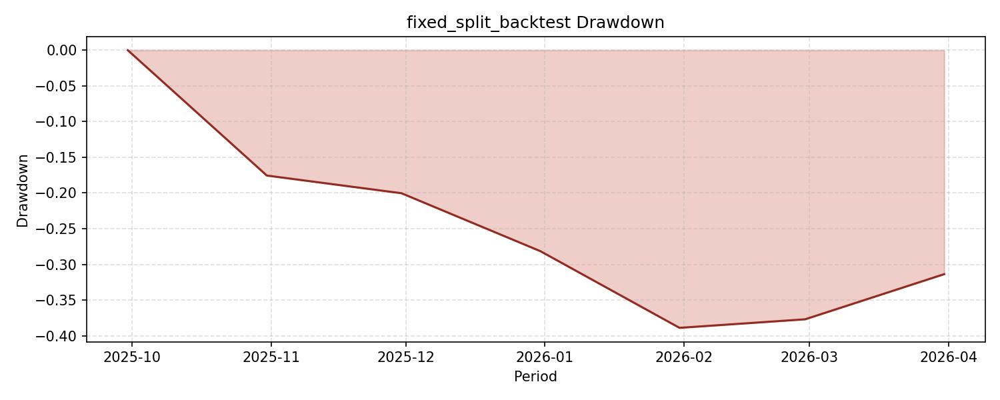
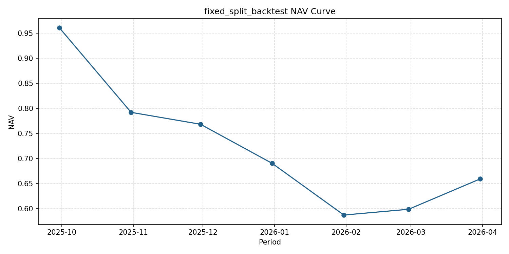
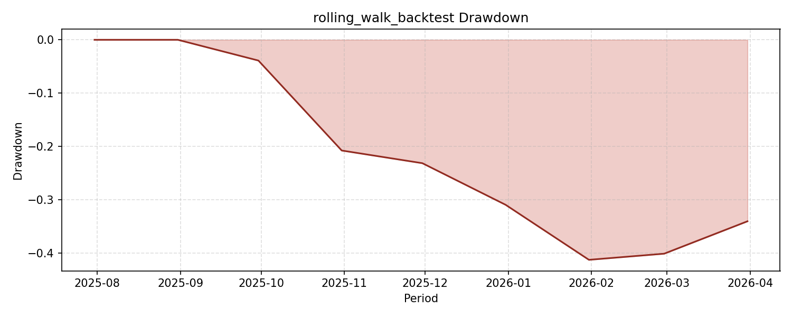
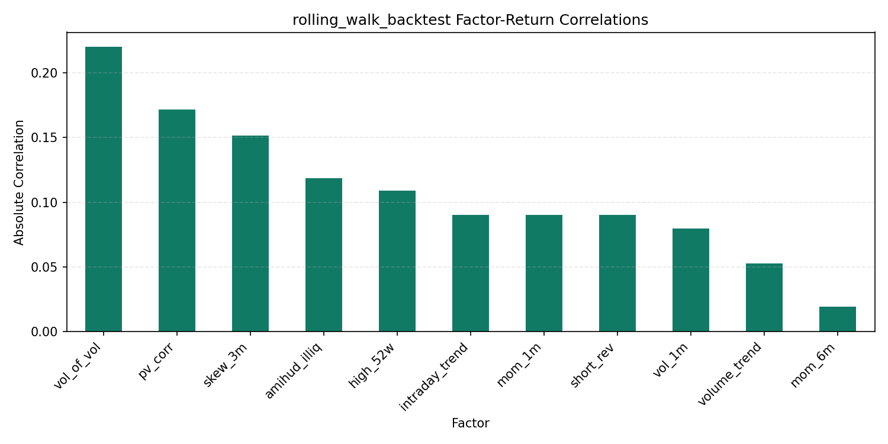
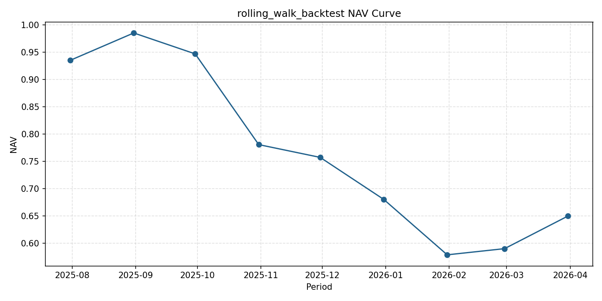

# Strategy Backtest Report

Generated: 2026-05-14 11:39:41

## Summary of Backtest Metrics

| Scenario | CAGR | Annual Vol | Sharpe | Sortino | Calmar | Win Rate | Max Drawdown | MDD Duration |
|---|---|---|---|---|---|---|---|---|
| fixed_split_backtest | -47.56% | 31.14% | -2.126 | -1.614 | -1.223 | 28.57% | -38.90% | 6 |
| rolling_walk_backtest | -38.45% | 29.92% | -1.786 | -1.374 | -0.931 | 33.33% | -41.28% | 7 |

## Visualizations

## Analysis Notes

## fixed_split_backtest Analysis Summary

- Chart files generated: `fixed_split_backtest_nav.png`, `fixed_split_backtest_drawdown.png`.

### Factor-Ret Correlation

The following factors are ranked by absolute correlation with forward returns:

- **vol_of_vol**: 0.2203
- **pv_corr**: 0.1715
- **skew_3m**: 0.1514
- **amihud_illiq**: 0.1186
- **high_52w**: 0.1089
- **intraday_trend**: 0.0901
- **mom_1m**: 0.0901
- **short_rev**: 0.0901
- **vol_1m**: 0.0795
- **volume_trend**: 0.0526
- **mom_6m**: 0.0191

- No quantile grouping exposure analysis could be generated.

### Performance Highlights

- Peak drawdown: -38.90%
- Periods analyzed: 7

For a deeper review, view the corresponding charts and CSV outputs in the `report/` directory.

## rolling_walk_backtest Analysis Summary

- Chart files generated: `rolling_walk_backtest_nav.png`, `rolling_walk_backtest_drawdown.png`.

### Factor-Ret Correlation

The following factors are ranked by absolute correlation with forward returns:

- **vol_of_vol**: 0.2203
- **pv_corr**: 0.1715
- **skew_3m**: 0.1514
- **amihud_illiq**: 0.1186
- **high_52w**: 0.1089
- **intraday_trend**: 0.0901
- **mom_1m**: 0.0901
- **short_rev**: 0.0901
- **vol_1m**: 0.0795
- **volume_trend**: 0.0526
- **mom_6m**: 0.0191

- No quantile grouping exposure analysis could be generated.

### Performance Highlights

- Peak drawdown: -41.28%
- Periods analyzed: 9

For a deeper review, view the corresponding charts and CSV outputs in the `report/` directory.

## Notes

- This report summarizes the backtest metric files generated under `result/`.
- Detailed analysis files and charts are saved under the `report/` folder.